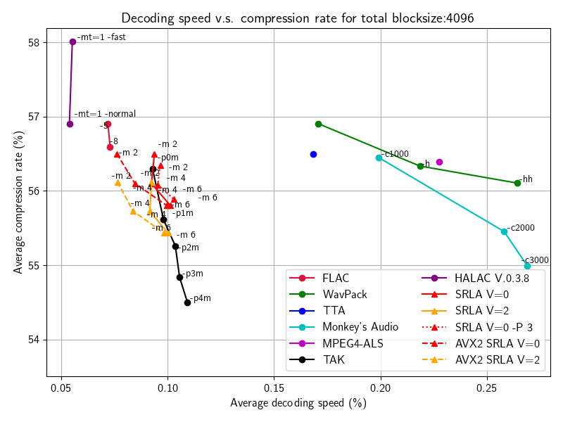
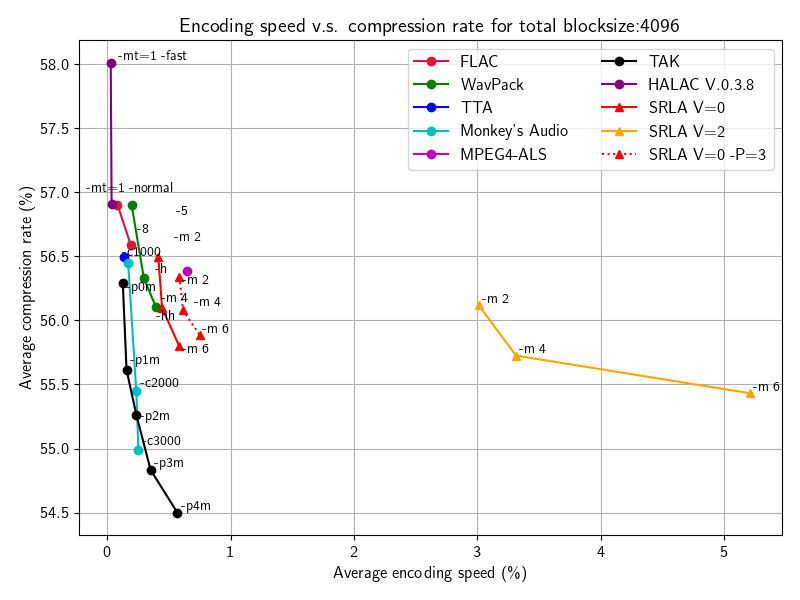

# SRLA

aka Soleil Rising Lossless Audio codec

# How to build

## Requirement

* [CMake](https://cmake.org) >= 3.15

## Build SRLA Codec

```bash
git clone https://github.com/aikiriao/SRLA.git
cd SRLA/tools/srla_codec
cmake -B build
cmake --build build
```

# Usage

## SRLA Codec

### Encode

```bash
./srla -e INPUT.wav OUTPUT.srl
```

#### Mode `-m`

You can change compression mode by `-m` option.
Following example encoding in maximum compression (but slow) option.

```bash
./srla -e -m 4 INPUT.wav OUTPUT.srl
```
#### Max block size `-B`

The'- B' option can change the maximum block size.
The following example encodes with a maximum block size of 4096 samples.

```bash
./srla -e -B 4096 INPUT.wav OUTPUT.srl
```

#### Number of divisions in block `-V`

You can change the number of divisions using the `-V` option. The number of divisions specifies the search depth of optimal block division.
The following example encodes with a number of divisions in the block to be $2^{2} = 4$.

```bash
./srla -e -V 2 INPUT.wav OUTPUT.srl
```

#### Lookahead sample factor `-L`

You can change the multiplying factor for lookahead samples in variable block division.
The following example is encoding with a lookahead factor of 8.

```bash
./srla -e -L 8 INPUT.wav OUTPUT.srl
```

#### Long-term prediction order `-P`

The `-P` option specifies long-term (pitch) prediction order, which improves the compression ratio, especially for vocal/pure tonal signals.
Following example encoding with long-term prediction order 3.

```bash
./srla -e -P 3 INPUT.wav OUTPUT.srl
```

### Decode

```bash
./srla -d INPUT.srl OUTPUT.wav
```
## Performance

We use [RWC music dataset](https://staff.aist.go.jp/m.goto/RWC-MDB/) for comparison.

### Decoding speed vs compression ratio



### Encoding speed vs compression ratio



## License

MIT
